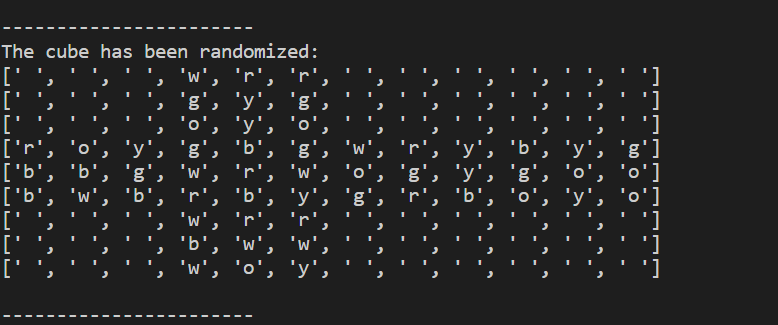
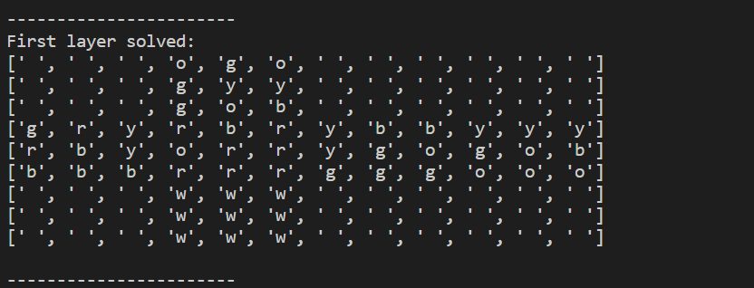
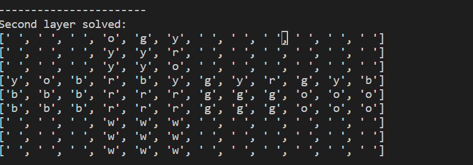
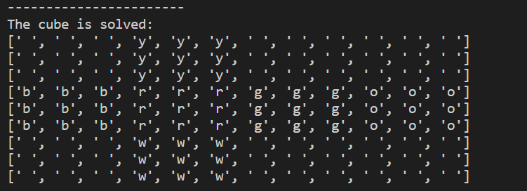
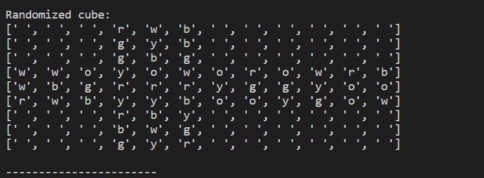
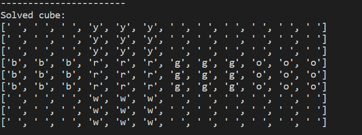

# RubiksCubeSolver

This is a program I am developing that automatically solve a Rubiks cube. Cube.py is the base class that contains all of the most important functionality to rotate, modify, and model the cube. The plan is to use the base class to implement a variety of Rubiks cube solving techniques, with the first algorithms I am implementing being the Thistlewaite algorithm and the more generic beginner algorithms.

Right now, the program is able to solve the  ***entire cube*** using the most common algorithms within RegularAlgorithms.py

Cube.py contains the important functionalities which the algorithms will use to solve the cubes (namely the rotation function, since the rotations are very complex). It is the base class which all the other programs inherit from

ThistlewaiteCube.py does not yet contain any functionalities, but is intended to solve the cube using the Thistlewaite algorithm (which can solve the cube very quickly in less than 52 moves)

In the near future I plan to transition the program from using Python lists to NumPy arrays to make the code clearer and easier to understand.
Also being planned is a graphical user interface to visualize the cube and allow users to input their own cube states which the program can then solve.

# Pictures and explanations

The most common approach to solving the Rubiks cube is to use a layer-by-layer approach, rather than the more intuitive face-by-face approach.
### Using the following code solves the cube in a three-step process
```

cube = RegularAlgorithms()
cube.scrambleCube(1000) #1000 random moves to scramble the cube
print('The cube has been randomized: ')
cube.printCube()
print('-----------------------')
```

 
```
cube.solveWhiteLayer() #solves first layer
print('First layer solved: ')
cube.printCube()
print('-----------------------')
```
Here, the program solves the first layer, which is just the white face and its surrounding edges. The program also ensures that the color of the edges are lined up properly with the rest of the cube (for example, it makes sure that the blue edges surrounding the white face are all on the blue face, rather than spread out).


```
cube.solveMiddleLayer() #solves second layer
print('Second layer solved: ')
cube.printCube()
print('-----------------------')
```
The program next solves the middle layer.

```
cube.solveYellowLayer() #solves third and final layer
print('The cube is solved: ')
cube.printCube()
```
Finally, the program solves the top and final layer, which is usually the yellow face (since it is opposite the yellow face). It also ensures that side edges of each yellow 'cubie' match the color of the face they are on. For example, it does not allow a yellow piece that has blue on one side to be placed such that the blue part is on the green face.


### There is also a master function to entirely automate the solution process
```
cube = RegularAlgorithms() #creating the cube
cube.scrambleCube(1000) #scrambles the cube for 1000 randomized moves
print("Randomized cube: ")
cube.printCube()
print('-----------------------')
```

```
cube.solveCube()
print("Solved cube: ")
cube.printCube()
```


